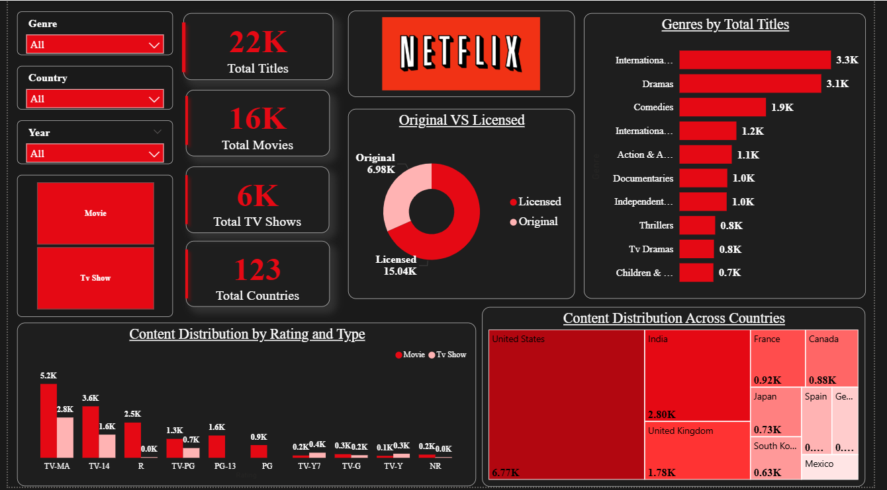
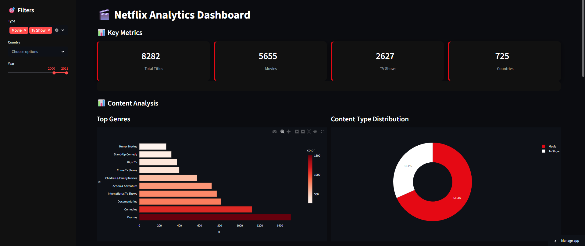

# 🎬 Netflix Content Strategy Analyzer

An end-to-end data analytics project that explores Netflix's content library using **Python**, **Machine Learning**, **Power BI**, and **Streamlit**. The project focuses on cleaning and analyzing Netflix data to uncover content trends, genre distribution, country-wise contributions, and business insights through interactive dashboards.

---

## 🎯 Project Objective

To analyze Netflix's content dataset by performing data cleaning, exploratory data analysis (EDA), feature engineering, and machine learning, followed by interactive dashboard development in Power BI and Streamlit for effective visualization and business decision-making.

---

## 📸 Dashboard Preview

### Power BI Dashboard



### Streamlit Dashboard



---

## 🛠️ Tech Stack

- **Python** – Data Cleaning, EDA & Machine Learning
- **Pandas & NumPy** – Data Manipulation
- **Matplotlib** – Data Visualization
- **Scikit-learn** – Machine Learning
- **Jupyter Notebook** – Analysis & Development
- **Power BI** – Interactive Dashboard
- **Streamlit** – Web Application

---

## 📂 Dataset Used

🔗 [Netflix Dataset](01_Dataset/Netflix_Titles.csv)

---

## ❓ Key Questions (KPIs)

- How has Netflix's content library grown over the years?
- Which countries contribute the most Netflix titles?
- Which genres dominate the platform?
- What is the distribution of Movies vs TV Shows?
- Which ratings are most common?
- How does content duration vary across titles?
- What factors influence content type classification?

---

## ⭐ Features

- Data Cleaning & Preprocessing using Python
- Exploratory Data Analysis (EDA)
- Feature Engineering
- Machine Learning Model Implementation
- Interactive Power BI Dashboard
- Streamlit Web Application
- Business Insights & Trend Analysis

---

## 📁 Project Structure

```text
Netflix-Content-Strategy-Analyzer
│
├── 01_Dataset
├── 02_Python
├── 03_PowerBI
├── 04_Streamlit
└── 05_Images
```

---

## 🔗 Project Files

📓 **Python Notebook**  
[Complete_Project.ipynb](02_Python/Complete_Python_Notebooks.ipynb)

📊 **Power BI Dashboard**  
[Netflix_dashboard.pbix](03_PowerBI/Netflix_dashboard.pbix)

🌐 **Streamlit Application**  
[View Dashbboard](https://netflix-app-dashboard-2mbjxjz4gv2gzy4j75jd9b.streamlit.app/)

---

## 🔄 Process / Workflow

- Collected and cleaned the Netflix dataset using Python.
- Performed Exploratory Data Analysis (EDA).
- Engineered new features for improved analysis.
- Applied Machine Learning techniques for content analysis.
- Built an interactive Power BI dashboard.
- Developed a Streamlit web application for data exploration.
- Derived business insights from visualizations and analysis.

---

## 🔍 Project Insights

- Movies constitute the majority of Netflix's content library.
- Drama and International genres are among the most popular.
- The United States contributes the highest number of Netflix titles.
- Netflix experienced rapid content growth after 2015.
- TV Shows generally have fewer seasons, while Movies dominate overall content.
- Interactive dashboards make it easier to explore content trends and patterns.

---

## 🧾 Final Conclusion

The Netflix Content Strategy Analyzer provides a comprehensive analysis of Netflix's content catalog by combining Python, Machine Learning, Power BI, and Streamlit. The project demonstrates the complete data analytics workflow—from raw data preprocessing to interactive visualization—helping users understand content trends, audience preferences, and strategic insights for better decision-making.

---
